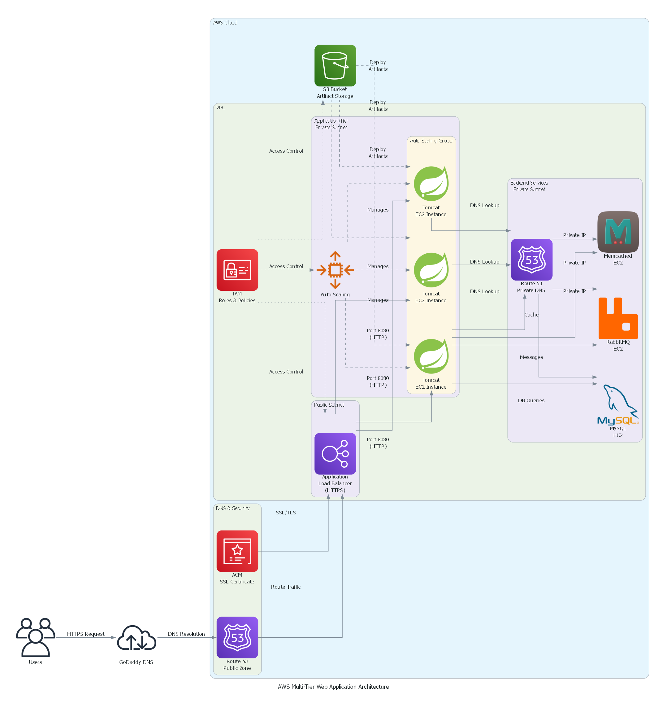

# AWS Multi-Tier Web Application Stack

A production-ready, highly available multi-tier web application deployed on AWS cloud infrastructure. This project demonstrates the migration and modernization of a legacy on-premises application (vProfile) to a scalable, cloud-native architecture.

[](https://aws.amazon.com/)
[](https://tomcat.apache.org/)
[](https://www.mysql.com/)
[](https://www.rabbitmq.com/)

## 🏗️ Architecture Overview

This project implements a three-tier architecture on AWS with automated scaling, load balancing, and secure network configuration.

### Architecture Diagram


```
[Users] → [GoDaddy DNS] → [Route 53] → [Application Load Balancer] → [Auto Scaling Group - Tomcat Servers] → [Backend Services]
                                              ↓                              ↓                                    ↓
                                            [ACM]                      [Security Groups]                   [MySQL, RabbitMQ, Memcached]
```

## 🚀 Features

- **High Availability**: Application Load Balancer distributes traffic across multiple availability zones
- **Auto Scaling**: Dynamic capacity adjustment based on demand
- **Secure Communication**: HTTPS encryption with AWS Certificate Manager
- **Service Discovery**: Private DNS using Route 53 for backend service resolution
- **Network Isolation**: Multi-layered security groups for defense in depth
- **Artifact Management**: S3-based storage with Maven build automation

## 🛠️ Technology Stack

### AWS Services
- **EC2**: Compute instances for application and backend services
- **Application Load Balancer (ALB)**: Traffic distribution and SSL termination
- **Auto Scaling Groups**: Automated capacity management
- **Route 53**: Private DNS zones for internal service discovery
- **VPC**: Network isolation and security
- **S3**: Artifact storage
- **IAM**: Access management and permissions
- **ACM**: SSL/TLS certificate management
- **EBS**: Persistent block storage

### Application Stack
- **Apache Tomcat**: Application server (Java web application)
- **MySQL**: Relational database
- **RabbitMQ**: Message broker
- **Memcached**: Distributed caching system
- **Maven**: Build automation and dependency management

## 🔒 Security Architecture

### Security Groups Configuration

1. **Load Balancer Security Group**
   - Inbound: HTTPS (443) from internet (0.0.0.0/0)
   - Outbound: Port 8080 to Tomcat instances

2. **Application Tier Security Group**
   - Inbound: Port 8080 from Load Balancer security group only
   - Outbound: Access to backend services security group

3. **Backend Services Security Group**
   - Inbound: 
     - MySQL (3306) from Application tier
     - RabbitMQ (5672, 15672) from Application tier
     - Memcached (11211) from Application tier
   - Outbound: All traffic allowed

## 📊 Traffic Flow

1. Users access application via custom domain registered in GoDaddy DNS
2. DNS resolves to AWS Route 53 hosted zone
3. Route 53 directs traffic to Application Load Balancer endpoint
4. ALB terminates SSL using ACM certificate
5. ALB distributes requests to healthy Tomcat instances (port 8080)
6. Auto Scaling Group maintains desired capacity based on CloudWatch metrics
7. Tomcat instances query Route 53 private DNS for backend service endpoints
8. Application communicates with MySQL, RabbitMQ, and Memcached using private IPs

## 🎯 Project Objectives

This project was undertaken to:
- Migrate a legacy on-premises application to cloud infrastructure
- Implement modern DevOps practices and cloud-native architecture
- Achieve cost optimization through auto-scaling
- Improve application availability and fault tolerance
- Enhance security with AWS best practices

## 💡 Key Learnings

- AWS networking and VPC configuration
- Load balancing strategies and SSL/TLS management
- Auto Scaling policies and CloudWatch metrics
- Service discovery patterns with Route 53
- Security group design and network isolation
- Infrastructure automation and deployment strategies

## 📋 Prerequisites

Before you begin, ensure you have:

- AWS Account with appropriate permissions
- AWS CLI installed and configured, or you could do it using AWS console
- Domain name (can use GoDaddy, Route 53, or any registrar)
- Maven installed (version 3.6+)
- Java JDK 11 or higher
- SSH key pair for EC2 access
- Basic knowledge of AWS services and Linux commands

## 📝 Setup Instructions

### Step 1: VPC and Network Configuration
```bash
# Create VPC
aws ec2 create-vpc --cidr-block 10.0.0.0/16 --tag-specifications 'ResourceType=vpc,Tags=[{Key=Name,Value=vprofile-vpc}]'

# Create Public Subnets (for ALB)
aws ec2 create-subnet --vpc-id <vpc-id> --cidr-block 10.0.1.0/24 --availability-zone us-east-1a
aws ec2 create-subnet --vpc-id <vpc-id> --cidr-block 10.0.2.0/24 --availability-zone us-east-1b

# Create Private Subnets (for App and Backend)
aws ec2 create-subnet --vpc-id <vpc-id> --cidr-block 10.0.3.0/24 --availability-zone us-east-1a
aws ec2 create-subnet --vpc-id <vpc-id> --cidr-block 10.0.4.0/24 --availability-zone us-east-1b

# Create and attach Internet Gateway
aws ec2 create-internet-gateway
aws ec2 attach-internet-gateway --vpc-id <vpc-id> --internet-gateway-id <igw-id>

# Create NAT Gateway for private subnets
aws ec2 allocate-address --domain vpc
aws ec2 create-nat-gateway --subnet-id <public-subnet-id> --allocation-id <eip-allocation-id>
```

### Step 2: Security Groups Creation
```bash
# Create ALB Security Group
aws ec2 create-security-group --group-name vprofile-alb-sg \
  --description "Security group for Application Load Balancer" \
  --vpc-id <vpc-id>

# Allow HTTPS inbound
aws ec2 authorize-security-group-ingress --group-id <alb-sg-id> \
  --protocol tcp --port 443 --cidr 0.0.0.0/0

# Create Application Tier Security Group
aws ec2 create-security-group --group-name vprofile-app-sg \
  --description "Security group for Tomcat instances" \
  --vpc-id <vpc-id>

# Allow port 8080 from ALB only
aws ec2 authorize-security-group-ingress --group-id <app-sg-id> \
  --protocol tcp --port 8080 --source-group <alb-sg-id>

# Create Backend Security Group
aws ec2 create-security-group --group-name vprofile-backend-sg \
  --description "Security group for backend services" \
  --vpc-id <vpc-id>

# Allow MySQL, RabbitMQ, Memcached from App tier
aws ec2 authorize-security-group-ingress --group-id <backend-sg-id> \
  --protocol tcp --port 3306 --source-group <app-sg-id>
aws ec2 authorize-security-group-ingress --group-id <backend-sg-id> \
  --protocol tcp --port 5672 --source-group <app-sg-id>
aws ec2 authorize-security-group-ingress --group-id <backend-sg-id> \
  --protocol tcp --port 11211 --source-group <app-sg-id>
```

### Step 3: Backend Services Setup
```bash
# Launch MySQL Instance
aws ec2 run-instances --image-id ami-0c55b159cbfafe1f0 \
  --instance-type t2.micro --key-name <your-key-pair> \
  --security-group-ids <backend-sg-id> --subnet-id <private-subnet-id> \
  --user-data file://mysql-setup.sh \
  --tag-specifications 'ResourceType=instance,Tags=[{Key=Name,Value=vprofile-mysql}]'

# Launch RabbitMQ Instance
aws ec2 run-instances --image-id ami-0c55b159cbfafe1f0 \
  --instance-type t2.small --key-name <your-key-pair> \
  --security-group-ids <backend-sg-id> --subnet-id <private-subnet-id> \
  --user-data file://rabbitmq-setup.sh \
  --tag-specifications 'ResourceType=instance,Tags=[{Key=Name,Value=vprofile-rabbitmq}]'

# Launch Memcached Instance
aws ec2 run-instances --image-id ami-0c55b159cbfafe1f0 \
  --instance-type t2.micro --key-name <your-key-pair> \
  --security-group-ids <backend-sg-id> --subnet-id <private-subnet-id> \
  --user-data file://memcached-setup.sh \
  --tag-specifications 'ResourceType=instance,Tags=[{Key=Name,Value=vprofile-memcached}]'
```

### Step 4: Route 53 Private DNS Setup
```bash
# Create Private Hosted Zone
aws route53 create-hosted-zone --name vprofile.internal \
  --vpc VPCRegion=us-east-1,VPCId=<vpc-id> \
  --caller-reference $(date +%s)

# Create DNS records for backend services
# Create a JSON file: dns-records.json
cat > dns-records.json << EOF
{
  "Changes": [
    {
      "Action": "CREATE",
      "ResourceRecordSet": {
        "Name": "db01.vprofile.internal",
        "Type": "A",
        "TTL": 300,
        "ResourceRecords": [{"Value": "<mysql-private-ip>"}]
      }
    },
    {
      "Action": "CREATE",
      "ResourceRecordSet": {
        "Name": "rmq01.vprofile.internal",
        "Type": "A",
        "TTL": 300,
        "ResourceRecords": [{"Value": "<rabbitmq-private-ip>"}]
      }
    },
    {
      "Action": "CREATE",
      "ResourceRecordSet": {
        "Name": "mc01.vprofile.internal",
        "Type": "A",
        "TTL": 300,
        "ResourceRecords": [{"Value": "<memcached-private-ip>"}]
      }
    }
  ]
}
EOF

# Apply DNS changes
aws route53 change-resource-record-sets --hosted-zone-id <zone-id> \
  --change-batch file://dns-records.json
```

### Step 5: Build and Upload Application Artifact
```bash
# Clone your application repository
git clone <your-vprofile-repo>
cd vprofile-project

# Build with Maven
mvn clean install

# Create S3 bucket for artifacts
aws s3 mb s3://vprofile-artifacts-$(date +%s)

# Upload artifact to S3
aws s3 cp target/vprofile-v2.war s3://<your-bucket-name>/
```

### Step 6: Create Launch Template for Tomcat
```bash
# Create a user data script: tomcat-userdata.sh
cat > tomcat-userdata.sh << 'EOF'
#!/bin/bash
yum update -y
yum install -y java-11-openjdk tomcat wget

# Download application from S3
aws s3 cp s3://<your-bucket-name>/vprofile-v2.war /usr/share/tomcat/webapps/

# Update application.properties with Route53 DNS names
cat > /usr/share/tomcat/webapps/application.properties << PROPS
jdbc.url=jdbc:mysql://db01.vprofile.internal:3306/accounts
rabbitmq.address=rmq01.vprofile.internal
memcached.address=mc01.vprofile.internal
PROPS

# Start Tomcat
systemctl start tomcat
systemctl enable tomcat
EOF

# Create Launch Template
aws ec2 create-launch-template --launch-template-name vprofile-tomcat-lt \
  --version-description "Tomcat v1" \
  --launch-template-data '{
    "ImageId": "ami-0c55b159cbfafe1f0",
    "InstanceType": "t2.micro",
    "KeyName": "<your-key-pair>",
    "SecurityGroupIds": ["<app-sg-id>"],
    "UserData": "'$(base64 -w0 tomcat-userdata.sh)'",
    "IamInstanceProfile": {"Name": "<ec2-s3-access-role>"}
  }'
```

### Step 7: Create Application Load Balancer
```bash
# Create Target Group
aws elbv2 create-target-group --name vprofile-tg \
  --protocol HTTP --port 8080 --vpc-id <vpc-id> \
  --health-check-path /login --health-check-interval-seconds 30

# Request SSL Certificate from ACM
aws acm request-certificate --domain-name <yourdomain.com> \
  --validation-method DNS

# Create Application Load Balancer
aws elbv2 create-load-balancer --name vprofile-alb \
  --subnets <public-subnet-1-id> <public-subnet-2-id> \
  --security-groups <alb-sg-id> --scheme internet-facing

# Create HTTPS Listener
aws elbv2 create-listener --load-balancer-arn <alb-arn> \
  --protocol HTTPS --port 443 \
  --certificates CertificateArn=<acm-certificate-arn> \
  --default-actions Type=forward,TargetGroupArn=<target-group-arn>
```

### Step 8: Create Auto Scaling Group
```bash
# Create Auto Scaling Group
aws autoscaling create-auto-scaling-group \
  --auto-scaling-group-name vprofile-asg \
  --launch-template LaunchTemplateName=vprofile-tomcat-lt \
  --min-size 2 --max-size 4 --desired-capacity 2 \
  --target-group-arns <target-group-arn> \
  --vpc-zone-identifier "<private-subnet-1-id>,<private-subnet-2-id>" \
  --health-check-type ELB --health-check-grace-period 300

# Create Scaling Policies
aws autoscaling put-scaling-policy \
  --auto-scaling-group-name vprofile-asg \
  --policy-name scale-up --scaling-adjustment 1 \
  --adjustment-type ChangeInCapacity

aws autoscaling put-scaling-policy \
  --auto-scaling-group-name vprofile-asg \
  --policy-name scale-down --scaling-adjustment -1 \
  --adjustment-type ChangeInCapacity
```

### Step 9: Configure DNS in GoDaddy/Route53
```bash
# Get ALB DNS name
aws elbv2 describe-load-balancers --names vprofile-alb \
  --query 'LoadBalancers[0].DNSName' --output text

# Create CNAME record in your DNS provider pointing to ALB DNS name
# Example: www.yourdomain.com -> vprofile-alb-xxxxxxxxx.us-east-1.elb.amazonaws.com
```

### Step 10: Verify Deployment
```bash
# Check Auto Scaling Group instances
aws autoscaling describe-auto-scaling-groups \
  --auto-scaling-group-names vprofile-asg

# Check Target Group health
aws elbv2 describe-target-health --target-group-arn <target-group-arn>

# Access your application
curl -I https://www.yourdomain.com
```

### Optional: CloudWatch Alarms Setup
```bash
# Create CloudWatch alarm for high CPU
aws cloudwatch put-metric-alarm --alarm-name vprofile-high-cpu \
  --alarm-description "Alarm when CPU exceeds 70%" \
  --metric-name CPUUtilization --namespace AWS/EC2 \
  --statistic Average --period 300 --threshold 70 \
  --comparison-operator GreaterThanThreshold \
  --evaluation-periods 2

# Create alarm for low CPU
aws cloudwatch put-metric-alarm --alarm-name vprofile-low-cpu \
  --alarm-description "Alarm when CPU below 30%" \
  --metric-name CPUUtilization --namespace AWS/EC2 \
  --statistic Average --period 300 --threshold 30 \
  --comparison-operator LessThanThreshold \
  --evaluation-periods 2
```

## 🔧 Configuration Files

Key configuration files needed:

- `application.properties` - Application configuration with backend service endpoints
- `mysql-setup.sh` - MySQL installation and database initialization script
- `rabbitmq-setup.sh` - RabbitMQ installation and configuration script
- `memcached-setup.sh` - Memcached installation script
- `tomcat-userdata.sh` - Tomcat installation and application deployment script

## 📈 Future Enhancements

- [ ] Infrastructure as Code using Terraform/CloudFormation
- [ ] CI/CD pipeline integration with AWS CodePipeline
- [ ] Container migration to ECS/EKS
- [ ] Database migration to RDS for managed services
- [ ] ElastiCache for Memcached/Redis
- [ ] Amazon MQ for RabbitMQ
- [ ] CloudWatch monitoring and alerting setup
- [ ] AWS Backup for disaster recovery
- [ ] Multi-region deployment for global availability

## 🤝 Contributing

Contributions are welcome! Here's how you can help:

### How to Contribute

1. **Fork the repository**
```bash
   git clone https://github.com/yourusername/aws-multitier-webapp.git
   cd aws-multitier-webapp
```

2. **Create a feature branch**
```bash
   git checkout -b feature/your-feature-name
```

3. **Make your changes**
   - Follow AWS best practices
   - Update documentation if needed
   - Test your changes thoroughly

4. **Commit your changes**
```bash
   git add .
   git commit -m "Add: Brief description of your changes"
```

5. **Push to your fork**
```bash
   git push origin feature/your-feature-name
```

6. **Open a Pull Request**
   - Provide a clear description of the changes
   - Reference any related issues
   - Ensure all checks pass

### Contribution Guidelines

- **Code Quality**: Follow infrastructure as code best practices
- **Documentation**: Update README and comments for any changes
- **Security**: Never commit sensitive information (keys, passwords, etc.)
- **Testing**: Test infrastructure changes in a development environment first
- **Commit Messages**: Use clear, descriptive commit messages
  - ✅ `Add: CloudWatch monitoring for RDS instances`
  - ✅ `Fix: Security group rule for ALB health checks`
  - ✅ `Update: Auto Scaling policy thresholds`
  - ❌ `fixed stuff`

### Areas for Contribution

- **Infrastructure Automation**: Terraform/CloudFormation templates
- **CI/CD**: GitHub Actions, CodePipeline configurations
- **Monitoring**: CloudWatch dashboards and alarms
- **Documentation**: Tutorials, troubleshooting guides
- **Cost Optimization**: Reserved instances, spot instances strategies
- **Security**: Additional security hardening measures

### Reporting Issues

If you find a bug or have a suggestion:

1. Check if the issue already exists
2. Create a new issue with:
   - Clear title and description
   - Steps to reproduce (for bugs)
   - Expected vs actual behavior
   - Screenshots if applicable
   - Your environment details (AWS region, instance types, etc.)

## 📞 Support

If you have questions or need help:

- 📧 Open an issue in this repository
- 💬 Start a discussion in the Discussions tab
- 📖 Check the [AWS Documentation](https://docs.aws.amazon.com/)

## 🙏 Acknowledgments

- AWS documentation and best practices guides
- The open-source community for tools and resources
- Contributors who have helped improve this project

## 👤 Author

**[Mohamed Othman]**

- 💼 LinkedIn: [Your LinkedIn Profile](https://linkedin.com/in/yourprofile)
- 🐱 GitHub: [MohamedEl-Sayed28](https://github.com/yourusername)
- 📧 Email: mohamedm.elsayedothman@gmail.com

---

**⭐ If you find this project helpful, please consider giving it a star!**

*Last Updated: November 2025*
